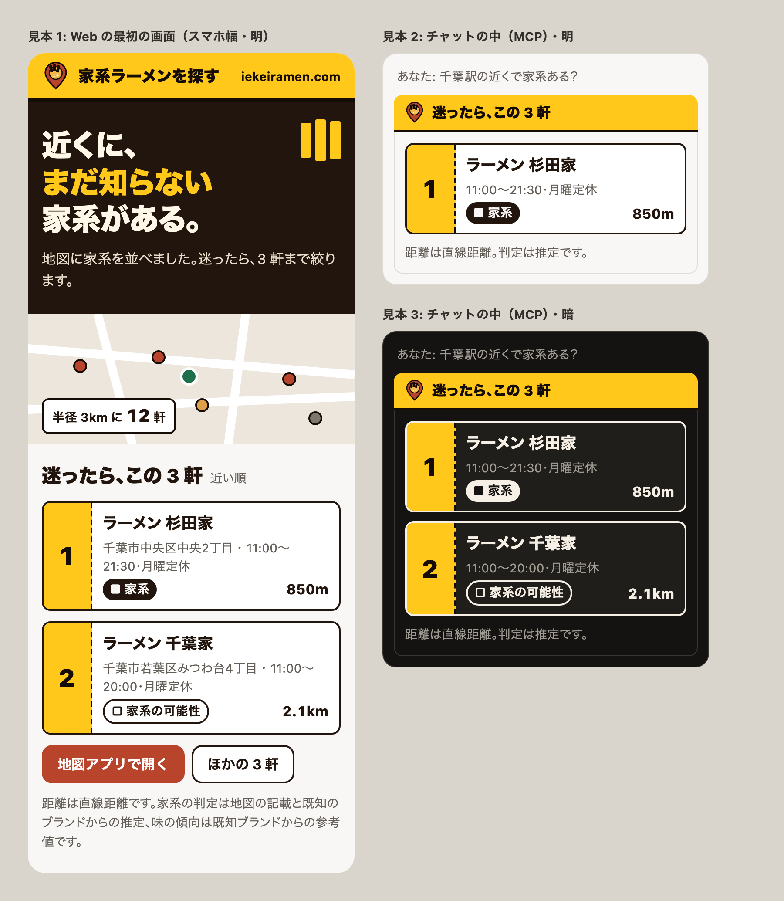

# デザイン仕様

家系ラーメンを探す MCP App の見た目の決まりごと。**新しい画面や部品を足すときは、
まずここを読んでトークンを当てはめる。** 足りないトークンがあったときだけ、
この文書に段を追加してから使う。

土台は[デジタル庁デザインシステム（DADS）](https://design.digital.go.jp/dads/)の
基礎（foundations）に倣っている。DADS の青とフォントは使わず、
**組み立て方だけを借りて、色は家系（醤油豚骨の茶赤）に置き換えている。**
その上に、家系の店先から借りたブランドを載せる（0 節）。

実体は次の3ファイル。

| ファイル                                         | 役割                                                 |
| ------------------------------------------------ | ---------------------------------------------------- |
| [src/global.css](src/global.css)                 | トークンの定義。色・余白・角丸・影・文字             |
| [src/mcp-app.module.css](src/mcp-app.module.css) | 部品のスタイル。トークンを組み合わせるだけ           |
| [src/oauth-consent.css](src/oauth-consent.css)   | ホスト外の認可画面。同じトークンでボタンと焦点を描く |

---

## 0. ブランドの方向: 店先の記号を借りる

約束は「知らなかった家系に、出会える」（一言:「近くに、まだ知らない家系がある。」）。
口調は熱いけれど誠実。**写真は使えない**（地図データに店の写真は無く、他所の写真は使えない）ので、
家系の店に行ったことがある人なら知っている記号で熱気を出す。2026-10-05 にオーナーが確認した（#123）。



| 何     | 借りるもの               | 決まり                                                                                         |
| ------ | ------------------------ | ---------------------------------------------------------------------------------------------- |
| 色     | 黄色い看板・醤油の黒     | 黄は看板帯と食券の半券だけ。**押せる部品の塗りに使わない**。押すのは茶赤                       |
| 文字   | 屋号の太さ               | 約束の一言と「迷ったら」の見出しだけ `--font-weight-display`（900）で大きく                    |
| ロゴ   | 地図のピン＋上から見た丼 | 海苔 3 枚＝「迷ったら 3 軒」。[BrandMark](src/components/BrandMark.tsx)                        |
| 3 軒   | 食券                     | 半券に番号。番号は表示順。並べた根拠を見出しの横に書き、「1 位」と言わない                     |
| 区切り | 太い線                   | 看板・食券は `--border-width-strong`（2px）の `--color-ink` で輪郭を出す。影とぼかしは使わない |

**判定の段階は形でも分ける。** 「家系」は塗り（■）、「家系の可能性」は枠だけ（□）。
色が見えにくい人にも違いが届く。「家系か未判定」の形は #128 で決める。

**ロゴは画像にしない。** 単一 HTML に固めるため、SVG を JSX で描き、色はトークンから取る。
16px の favicon で読めるかは #130 で確かめる。

---

## 1. 3 段構造

DADS に倣って、値は 3 段に分けてある。

```
プリミティブ      --ramen-600  --gray-200        色の階調そのもの。用途を持たない
      ↓
セマンティック    --color-accent  --color-border  用途に名前を付けたもの
      ↓
コンポーネント    .card  .button                  CSS Modules で組み立てる
```

**部品からプリミティブを直接読まないこと。** `--ramen-600` を `.card` に書くと、
ダークモードの差し替えが効かなくなる（プリミティブは明暗で変わらない値だから）。
必ず間にセマンティックを挟む。

ホストが渡してくるトークン（`--color-text-primary` など）も同じ扱いで、
`global.css` の冒頭にフォールバックを置いてある。ホストが値を渡してきたら
そちらが勝つ。**この層を上書きしないこと。** ホストのテーマから浮く。

---

## 2. 色

### プリミティブ

家系のブランド色は **`--ramen-600` = `#b8442c`**（醤油豚骨の茶赤）。
そこから明暗に伸ばした 11 段と、それに合わせて僅かに暖色へ寄せた灰 12 段を持つ。

```
--ramen-50   #fdf4f1     --gray-0    #ffffff
--ramen-100  #fae4dc     --gray-50   #f8f7f5
--ramen-200  #f3c5b6     --gray-100  #efedea
--ramen-300  #e89d87     --gray-200  #dedbd6
--ramen-400  #da7256     --gray-300  #c4c0b9
--ramen-500  #c85434     --gray-400  #a09b93
--ramen-600  #b8442c  ←  --gray-500  #7d776e
--ramen-700  #9a3623     --gray-600  #635e57
--ramen-800  #7c2c1d     --gray-700  #4a4640
--ramen-900  #5e2216     --gray-800  #33302c
--ramen-950  #33150f     --gray-900  #201e1b
                         --gray-950  #141312
```

看板の黄と醤油の黒（0 節）。**明暗で変えない。**

```
--kanban-300  #ffd84d    --shoyu-900  #22150e
--kanban-400  #ffc81a    --shoyu-950  #150c07
```

**黄は焦点リング（`#ffd43d`）とのコントラストが 1.1 しかない。** 押せる部品を黄で塗ると、
焦点が当たっても見分けが付かない。だから黄は押せない面（看板帯・半券）にだけ敷く。

灰を純灰（`#808080` 系）にすると、茶赤と並んだときに色が濁って見える。
**灰は必ずこの暖色寄りの段から取ること。**

### セマンティック

| トークン                     | 明                 | 暗                 | 使う場所                         |
| ---------------------------- | ------------------ | ------------------ | -------------------------------- |
| `--color-accent`             | ramen-600          | ramen-400          | 線・アイコン・18px 以上の文字    |
| `--color-accent-strong`      | ramen-700          | ramen-300          | **本文サイズの文字**             |
| `--color-accent-fill`        | ramen-600（固定）  | ramen-600（固定）  | 塗り（ボタン・選択中のチップ）   |
| `--color-accent-fill-hover`  | ramen-700（固定）  | ramen-700（固定）  | その hover                       |
| `--color-accent-soft`        | ramen-50           | #2a1510            | 選択中の面・hover の面           |
| `--color-accent-soft-strong` | ramen-100          | #3d1f16            | バッジの面                       |
| `--color-accent-border`      | ramen-200          | ramen-800          | 選択中の枠                       |
| `--color-surface`            | gray-0             | gray-900           | カード・入力欄の面               |
| `--color-surface-muted`      | gray-50            | gray-950           | 溝・空状態・muted バッジ         |
| `--color-border`             | gray-200           | #3a3733            | 通常の枠線                       |
| `--color-border-strong`      | gray-300           | gray-600           | 入力欄・第 2 ボタンの枠線        |
| `--color-text-muted`         | gray-600           | gray-400           | 補足文・ラベル                   |
| `--color-sign`               | kanban-400（固定） | kanban-400（固定） | 看板帯・食券の半券（押せない面） |
| `--color-on-sign`            | shoyu-950（固定）  | shoyu-950（固定）  | 看板の上の文字・ロゴの輪郭       |
| `--color-ink`                | shoyu-900          | #f6efe6            | 看板・食券の太い輪郭             |
| `--color-stage`              | shoyu-900          | shoyu-950          | 最初の画面の舞台（暗い面）       |
| `--color-on-stage`           | #fff8e8            | #fff8e8            | 舞台の上の見出し                 |
| `--color-on-stage-muted`     | #e9dccb            | #e9dccb            | 舞台の上の本文                   |
| `--color-on-stage-em`        | kanban-400         | kanban-300         | 舞台の上で強める語               |
| `--color-error`              | #ce0000            | #ff9b9b            | 失敗の文字                       |
| `--color-error-soft`         | #fdecec            | #3a1414            | 失敗の面                         |
| `--color-error-border`       | #f0b4b4            | #7a2424            | 失敗の枠                         |

### 色の落とし穴（踏んだもの）

**文字色と塗り色を同じトークンにしない。**
`--color-accent` を暗いテーマで明るい側（ramen-400）へ振ると、白抜き文字との
コントラストが **3.2** まで落ちて読めなくなる。だから塗りだけ `--color-accent-fill`
として **600 に固定** してある。600 と白は明暗どちらでも 5.4 で AA を満たす。

**本文サイズの文字に `--color-accent` を使わない。**
白地で 5.4 しか出ない。14px の文字は「大きい文字」の扱いにならないので 4.5 が要る。
ギリギリを狙わず `--color-accent-strong`（7.2 / 7.6、AAA）を使う。

**失敗の赤にブランド色を使わない。**
家系の色がすでに赤寄りなので、`--color-error` は彩度の高い純赤で別に持つ。
同じ色にすると「強調」と「異常」が見分けられない。

### コントラスト比（実測）

新しい組み合わせを足すときは、ここに追記できる比が出ることを先に確かめる。

| 組み合わせ                                        | 明   | 暗   |
| ------------------------------------------------- | ---- | ---- |
| `--color-accent-fill` に白抜き文字                | 5.4  | 5.4  |
| `--color-accent-strong` を面の上に                | 7.2  | 7.6  |
| `--color-text-muted` を `--color-surface` に      | 6.5  | 6.0  |
| バッジ（strong を soft-strong の上に）            | 5.9  | 6.8  |
| 行ったバッジ（白抜きを accent-fill に）           | 5.4  | 5.4  |
| `.buttonOn`（strong を accent-soft に）           | 6.6  | 7.9  |
| `--color-on-sign` を `--color-sign` に            | 12.4 | 12.4 |
| `--color-on-stage-em` を `--color-stage` に       | 11.4 | 14.0 |
| `--color-on-stage-muted` を `--color-stage` に    | 13.2 | 14.3 |
| `--color-sign` と焦点リング（使ってはいけない組） | 1.1  | 1.1  |

---

## 3. 余白

**8px グリッド。** 使うのはこの 7 段だけで、間の値は作らない。

```
--space-1   4px    要素の中の細かい隙間（バッジの並び、行間の微調整）
--space-2   8px    近いもの同士（ボタンの並び、バッジ、リストの項目間）
--space-3  12px    1 かたまりの中（カードの上下、フォームの行間）
--space-4  16px    かたまりの内側の余白（カードの左右、画面の外周）
--space-5  20px    画面の大きな区切り（.main の gap）
--space-6  24px    予備
--space-8  32px    空状態の上下など、広く取りたいところ
```

**隙間の広さで関係を示す。** 近いものは近く、別のものは離す。
迷ったら `--space-3`（かたまりの中）か `--space-4`（かたまりの外）のどちらかに寄せる。

---

## 4. 角丸

小さい図形ほど丸みが強く見えるので、部品の大きさごとに段を変える。

| トークン        | 値    | 使う部品                           |
| --------------- | ----- | ---------------------------------- |
| `--radius-sm`   | 8px   | タブ（溝の中の小さい面）           |
| `--radius-md`   | 12px  | カード・ボタン・入力欄・選択中の枠 |
| `--radius-lg`   | 16px  | 地図・空状態など、面の大きいもの   |
| `--radius-full` | 999px | チップ・バッジ・件数               |

---

## 5. 影

**平常時は枠線だけ。影は「浮いている＝いま触っている」の合図に取っておく。**
最初から全部に影を付けると、何が操作できるのか分からなくなる。

看板と食券（0 節）は影ではなく `--border-width-strong`（2px）の線で形を出す。

```
--elevation-1   カードの hover、選択中の項目、選択中のタブ
--elevation-2   予備（モーダルなど、面の上に面を重ねるとき）
```

---

## 6. 文字

### 大きさ

ホストから来る段（`--font-heading-*`）をそのまま使う。

| 用途         | トークン                 | 値                                       |
| ------------ | ------------------------ | ---------------------------------------- |
| 約束の一言   | `--font-display-size`    | 34px（太さ `--font-weight-display` 900） |
| 見出し       | `--font-heading-lg-size` | 20px                                     |
| 本文         | `--font-text-md-size`    | 16px                                     |
| ボタン・タブ | `--font-heading-sm-size` | 14px                                     |
| 注記・バッジ | `--font-size-note`       | 14px                                     |

**14px より小さくしない。** DADS が認めていない。
以前この UI は注記とバッジを 12px で出していたが、全部 14px に上げてある。
「入りきらないから小さくする」は、入れる情報を減らす合図。

### 行高・字間

- 本文の行高は **1.5 以上**。注記は 1.6。
- 小さい和文の字間は **0.02em**（`--letter-spacing-normal`）。body に当ててある。
- 見出しは詰める **-0.01em**（`--letter-spacing-tight`）。あわせて `text-wrap: balance`。
- body に `font-feature-settings: "palt" 1`。和文の約物が全角のまま並ぶと
  隙間だらけに見えるので詰めて組む。

### 数字

**並べて比べる数字には `font-variant-numeric: tabular-nums` を付ける。**
距離・件数・順位がこれ。桁が変わったときに幅が動いて、目が滑る。

### JSX での和文

**JSX のテキストは改行のたびに空白 1 個へ畳まれる。**
和文だと語の途中に隙間が空くので、続く 1 文は 1 本の文字列にして定数で持つ。

<!-- prettier-ignore -->
```text
だめ（読む側には「この店を 話題にした」と空白が入って見える）
  <p>
    「この店について聞く」を押すと、この店を
    話題にした質問が送られます。
  </p>

よい
  const NOTE = "「この店について聞く」を押すと、この店を話題にした質問が送られます。";
  <p>{NOTE}</p>
```

---

## 7. 操作できるもの

### 押せる大きさ

**ボタンと入力欄は `min-height: 44px`。** チップは 36px。
認可画面は `--control-min-size: 44px` を高さと幅の下限に使う。ボタン間は
`--space-4`、本文幅は最大40rem。共通トークンと認可画面のCSSをビルド時に埋め込み、
リクエストごとのnonceでこのstyleだけをCSPで許可する。
これ以下に詰めると、指で隣を押してしまう。

### 焦点（フォーカス）

**DADS の黄＋黒の二重リング。** 全部の操作部品で同じものを使う。

```css
outline: 3px solid var(--color-focus-ring); /* #ffd43d */
outline-offset: 1px;
box-shadow: 0 0 0 5px var(--color-focus-edge); /* #141312 */
```

片方だけだと、明るい面では黄が、暗い面では黒が消える。
`box-shadow` の方を 1px 外へ出して黄を縁取っている。
**色に意味を持たせない**（成功・警告と混ざらない）ので、どんな背景の上でも使える。

新しく押せるものを足したら、`mcp-app.module.css` の `:focus-visible` の
セレクタ一覧に必ず追加する。

**黒い縁は `box-shadow` で描いている。** hover や選択中の `box-shadow` と
取り合いになるので、置き方に 2 つ決まりがある。淡い面の上で黄だけが残ると
コントラストは **1.3** まで落ち、事実上見えなくなる。

1. **焦点の節はファイルの末尾に置く。** 同じ強さ（クラス 2 つ）の状態指定には
   順番でしか勝てない。前に置くと `.card:hover` に負ける
2. **状態側で影を消すときは `:not(:focus-visible)` を付ける。**
   `.listItemSelected .card:hover` はクラス 3 つぶんの強さがあり、
   末尾に置いても焦点の指定が勝てない

```css
/* 選択中は影を消す。ただし焦点が当たっている間は消さない */
.listItemSelected .card:not(:focus-visible),
.listItemSelected .card:hover:not(:focus-visible) {
  box-shadow: none;
}
```

E2E の「キーボードで選んでも焦点リングの黒い縁が残る」がこの 2 つを見張っている。

### 状態の見せ方

| 状態     | 見せ方                                                       |
| -------- | ------------------------------------------------------------ |
| hover    | 枠線をアクセント色へ、`--elevation-1`、カードは 1px 持ち上げ |
| active   | 持ち上げと影を戻す（押し込まれた感じ）                       |
| selected | 左に 4px のアクセントの辺 ＋ `--color-accent-soft` の面      |
| disabled | `opacity: 0.45`、`cursor: default`                           |

### 動き

```
--duration-fast      120ms
--easing-standard    cubic-bezier(0.2, 0, 0.1, 1)
```

**変えるのは色・影・1px の移動まで。** 拡大・回転・跳ねは入れない。
`prefers-reduced-motion: reduce` で全部止まるようにしてある（global.css）。

---

## 8. 部品の決まり

### カード（店舗）

```
┌ ← 選択中は 4px のアクセント辺
│ 1   壱八家  西区                              272m   ← 店名が一番強い（16px・太字）
│     推定 [■ 家系] [クリーミー] [壱八家]              ← 判定の段階は常に、店名のすぐ下
│     神奈川県 横浜市 西区高島2丁目…                  ← 細かい情報は後ろ・控えめな色
│     営業 11:00〜23:00
│   ── 詳細（選んだときだけ・同じ枠の中）──
│     [地図で開く] [この店について聞く] [まわる店に追加]
│     ▸ 注文のしかた
│     ─────────────
│     行った   選択を解除                          ← 枠の無い控えめなボタン
│     ▸ 店舗情報を報告する
└
```

- 枠は 1 本だけ。**選択中の詳細をカードの外にもう 1 枚の枠で出さない。**
  同じ店の情報が 2 つ並んでいるように見える（一度やって作り直した）。
- 詳細は選んだカードの **直下** に、同じ枠の中へ続けて描く。
  一覧の上に置くと、選んだ瞬間に一覧が下へずれて次のカードを押せない。
- 味・ブランドのバッジは **塗りだけ**。枠と塗りを両方付けると、カード 1 枚に線が何本も走る。
  高さを揃えるため枠は透明で確保しておく。

### 判定の段階のバッジ

**「家系」も含めて、常に出す。** 色だけで分けず、形で強さを揃える（#128、オーナー確認の宿題）。

| 段階         | 形                                    | クラス            |
| ------------ | ------------------------------------- | ----------------- |
| 家系         | ■ 塗り（`--color-ink`、文字は面の色） | `.stageConfirmed` |
| 家系の可能性 | □ 太い枠だけ（2px の `--color-ink`）  | `.stageLikely`    |
| 家系か未判定 | ？ 枠も塗りも無し、控えめな文字       | `.stageCandidate` |

- 先頭に「推定」と添える。段階も味の傾向も推定なので、カードだけ見ても分かるようにする
- 記号（■□？）は `aria-hidden`。読み上げは段階の名前だけにする
- 「行った」は塗らない（スタンプは特典の無いサブ機能）。✓ は CSS で付け、文字列は「行った」のまま

### 詳細の並び

**行き先 → 初めての人向けの注文 → 控えめな記録と報告。** 選んだ人の次の行動は地図アプリなので、
「地図で開く」を第 1 ボタン（塗り）にする。「この店について聞く」「まわる店に追加」は第 2 ボタン。
「行った」「選択を解除」は `.buttonQuiet`（枠も塗りも無い。押せる大きさは 44px のまま）で、
上に線を 1 本引いて主な操作と離す。報告はその下に置き、目立たせすぎない。

### 最初の画面（Web だけ、`PromiseHero`）

開いて 3 秒で約束が伝わるように、見出しの上に**醤油の黒の舞台**（`--color-stage`）を置く（#125）。

- 一言「近くに、まだ知らない家系がある。」を `--font-weight-display` で。「まだ知らない」だけ `--color-on-stage-em`（黄）
- 入口は 2 つ。「地図で見る」（第 1 ボタン）と「迷ったら 3 軒に絞る」（舞台用の白抜き `.heroSecondary`）
- 但し書き（推定・直線距離）を舞台の中にも短く残す
- 右上に海苔 3 枚（`--color-sign`、飾り）
- **最初の画面に地図を入れる。** 狭い幅では一言を小さくし、地図モードでは絞り込みを地図の下に回す。
  並びは DOM で入れ替える（CSS の `order` だと読み上げと Tab の順がずれる）
- 都道府県・店のページ（`public/seo.css`）も同じ部品: 舞台の色の帯にロゴと黄の名前、判定の段階は ■ □ ？

### 食券（「迷ったら」の 3 軒）

`ShopList` に `ticket` を渡すと、カードが食券になる（`.tickets`）。

- 半券は `--color-sign` の面に表示順の番号、`--color-on-sign` の破線で切り取り線を引く。輪郭は 2px の `--color-ink`
- **番号は表示順で、順位ではない。** 3 軒とも同じ大きさで、「1 位」のような言葉は使わない。
  並べた根拠（「近い順」「営業時間が分かる店から順」）を見出しの横に出す（`basisLabel`）
- 出る瞬間は 1 軒ずつ 90ms ずらして浮かび上がる（濃さと 1px の移動だけ）。`prefers-reduced-motion` では動かさない
- 次の組へは「次の 3 軒を見る」。末尾の組では「最初の 3 軒に戻る」と、押す前に何が起きるかを言う
- 近い順の一覧（現在地から探す）は食券にしない。決める場面は「迷ったら」だけ

### カードの詰め方（広いホスト）

`40rem` 以上では、カードの中身を 1 行に並べる（店名 / 住所・営業 / バッジ）。

```
狭い（〜40rem）          広い（40rem〜）
┌──────────────┐        ┌────────────────────────────────────┐
│ 壱八家        │        │ 壱八家   横浜市西区…   [クリーミー] │
│ 神奈川県 横浜… │        └────────────────────────────────────┘
│ [クリーミー]   │         55px（縦積みだと 108px）
└──────────────┘
```

**縦積みのままだと、幅が 1400px あってもカード 1 枚が 108px を使い、一覧に
4 枚弱しか収まらない。** 横に 1000px 以上空いたまま縦にだけ伸びる状態で、
ChatGPT で「窮屈で見づらい」と言われたのがこれ。横へ逃がすと同じ高さに
7〜8 枚入る。

- **1 行を保つのは `white-space: nowrap`、溢れを防ぐのは `min-width: 0`。**
  折り返しを許すと 20 文字超の店名が 2 行になり（55px → 78px）、逆に店名を
  縮めない（`0 0 auto`）と縮まない要素だけで幅を超えて一覧が横へ溢れる。
  **どちらも 1 行にした意味を壊す**
- **削られる順番は `flex-basis` が決める。** 住所は `0`（余った幅だけ）なので
  真っ先に潰れ、店名は `auto`（中身の幅）なので最後に縮む。`flex-shrink` の比を
  足しても変わらない（`1000` を入れて測ったが、店名の幅は 1px も動かなかった）
- 幅の広いところだけ見ても足りない。**`40rem` を少し超えた幅**（横に並べ始めた
  直後）が一番きつく、そこに長い店名を置いて確かめる
- 住所・営業時間は 1 行に収めて省略する（`text-overflow: ellipsis`）
- バッジは右端へ寄せ、折り返さない
- **カードを多列（グリッド）に割らないこと。** 詳細を「選んだカードの直下・
  同じ枠の中」に出す決まりが崩れ、枠を 2 つにする作り（一度やって作り直した形）
  に戻ってしまう。列を増やすより 1 枚を薄くする

### 一覧（`.list`）

- `max-height: 26rem` ＋ `overflow-y: auto`。
- **`.list > li { flex-shrink: 0 }` を外さないこと。**
  flex の既定では項目が縮み、中身が隣のカードに重なる（選択中の項目が 2px まで潰れた）。
- **選択中の項目に `overflow: hidden` を使わない。** flex 項目の自動最小高さが
  効かなくなって同じ潰れ方をする。左の辺は `border-left` で出す。
- 影と焦点リングが両端で切れないよう、`padding: 4px` ＋ 同量の負の margin で逃がす。

### タブ

溝（`--color-surface-muted`）の中で、選択中だけを `--color-surface` へ持ち上げ、
`inset 0 -2px 0 var(--color-accent)` で下辺に線を引く。
**塗り潰さない。** 3 つとも主張して、下の検索条件より目立ってしまう。

**横に並べるものは、狭いホストで折り返せるようにしておく。**
ホストの iframe は 375px ということもあり、和文ラベル 3 つは 1 行に収まらない。
溝からはみ出すと、アプリごと横スクロールが出る。

- 溝に `flex-wrap: wrap`
- 項目は `flex: 1 1 5.5rem`。**`flex: 1`（基準 0）にしない。**
  基準が 0 だと折り返しの判断が効かず、はみ出したまま一列に並んでしまう
- 左右の余白は `--space-1` まで削る。広いときは伸びるので、見た目は変わらない

### 行った店・制覇率

```
┌────────────────────────────┐
│ 3 / 558 軒            0.5% │
│ ████░░░░░░░░░░░░░░░░░░░░░░ │
│ 神奈川県  ███░░░░░░░   2/121 │
└────────────────────────────┘
```

- 帯は `--color-surface-muted` の溝に `--color-accent-fill` を敷く。
  **幅は割合そのもの**（トークンに無い値だが、これは見た目ではなくデータ）
- 数字は `tabular-nums`。並べて比べるものなので、桁で幅が動くと目が滑る
- **順位も称号も作らない。** 持っているのは軒数だけで、頑張りの度合いを
  語る材料が無い
- 読み上げには `role="img"` ＋ `aria-label`（「121 軒中 2 軒（1.7%）」）。
  帯そのものは形しか持たない

### 押している状態のボタン（`.buttonOn`）

「行った」のように、入っているかどうかを持つボタン。
**第 1 ボタンの塗り（`.button`）を使わない**——一番強い操作（「地図で開く」）と同じ重さに
なり、どちらが主か読めなくなる。選択中の見せ方に合わせて
`--color-accent-soft` の面 ＋ `--color-accent` の枠 ＋ `--color-accent-strong` の文字。
状態は `aria-pressed` でも持つ。

### 元に戻せないボタン（`.buttonDanger`）

記録の全消去など。**ブランドの赤ではなく失敗の赤**（`--color-error-*`）を使う。
家系の色もすでに赤寄りなので、同じ色だと「強調」と「異常」が見分けられない。
**押したら 2 段階にする**（「記録を全部消す」→「本当に全部消す」／「やめる」）。
ダイアログは重ねない——狭いホストでは枠の外に出る。

### 空状態・失敗

破線の枠は「まだ置かれていない場所」に見えるので使わない。
面の色（`--color-surface-muted`）で静かに示す。
失敗だけ `--color-error-*` の 3 点セットに差し替える。

### 地図

Leaflet は CSS 変数を受け取らないので、
[MapView.tsx](src/components/MapView.tsx) だけ実値を持っている。
**パレットを変えたらここも手で合わせる。**

**ピンの形は判定の段階、色は味の傾向**（#126）。カードの ■ □ ？ と同じ強さの順で、
色が見えにくくても段階が読める。**点線は使わない**（破線は順路の線の印）。

| 段階         | 形                                                                             |
| ------------ | ------------------------------------------------------------------------------ |
| 家系         | 半径 7・味の色で塗る・醤油の黒（`#150c07`）の縁 2px                            |
| 家系の可能性 | 半径 7・白抜き・味の色の縁 3px                                                 |
| 家系か未判定 | 半径 4.5・白抜き・灰（`#635e57`、gray-600）の縁 1.5px                          |
| 選択中       | 形はそのまま大きく（半径 11、未判定は 9）・縁を 1px 太く。縁を一律に黒くしない |

行った印の点は、塗りのピンには白、白抜きのピンには黒で打つ。

| ピン       | 色                                                     | 由来               |
| ---------- | ------------------------------------------------------ | ------------------ |
| 濃厚       | `#b8442c`                                              | ramen-600          |
| クリーミー | `#e0a04a`                                              | —                  |
| チェーン   | `#4a7fb8`                                              | —                  |
| 味は未判定 | `#7d776e`                                              | gray-500           |
| 選択中の縁 | `#141312`                                              | gray-950           |
| 順路の線   | `#141312`                                              | gray-950           |
| 順路の番号 | `#b8442c`                                              | ramen-600          |
| 塊         | 面 `--color-stage`・数字 `--color-on-stage-em`・白い縁 | 醤油の黒に看板の黄 |
| 基準地点   | `#1f6f4a`                                              | —                  |
| 行った印   | `#ffffff`                                              | —                  |

**順路の線は破線（`6 6`・不透明度 0.55）。** 引いているのは店と店を直線で
結んだものであって、経路探索の結果ではない。実線にすると「この道を通る」と
読めてしまう。

番号は `divIcon`（ただの HTML）で描く。Leaflet の既定アイコンは PNG を外部
参照するので、単一 HTML に固められない。`.leaflet-div-icon` の白い四角と
クラス 1 つ同士で競合するため、`.routePin.routePin` と 2 回書いて詳細度で勝たせる。

**色と実値は [map-layers.ts](src/components/map-layers.ts) が持つ。**
Leaflet に触る部分をそこへ集めてあるので、MapView.tsx には色が無い。

**行った店は色を増やさず、中心に点を打つ。** 色で表すと味のパレットと
衝突し、縁で表すと「選択中」（黒い縁）と見分けが付かない。点は
`interactive: false` なので、下のピンがそのまま押せる。**印の意味は地図の下に
文字で書き、`aria-label` にも入れる**（色と形は、見えない人には届かない）。

**塊（クラスタ）には必ず件数を出す。** 数の無い丸は、押す前に何が起きるか
読めない。順路の番号（茶赤の面）と紛れないよう、塊は醤油の黒の面に黄の数字。
黄は押せる部品の塗りに使わない決まりなので、数字にだけ使う。

**同心円は点線（`4 6`）で、半径は直線距離の 500m と 1km。** 円の意味は
地図の下に文字で書く。徒歩◯分に換算する材料を持っていないので、黙っていると
「歩いて 6 分」と読まれる。

**全画面の地図は `70vh`。** 枠の中は 24rem。全画面で画面いっぱいにしないのは、
一覧を完全に追い出すと、押した店の詳細がどこに出たのか分からなくなるため。

**重なり順はペインで決める。** Leaflet の既定では、塊（divIcon）は
markerPane（600）、店のピン（circleMarker）は overlayPane（400）に載る。
**別のペインは `bringToFront` では追い越せない**ので、選んだ店が 36px の塊に
覆われたままになる（実測: 選んだ 1 軒と残りの塊の中心が 0.4〜3.3px）。

| 何                   | z-index                   |
| -------------------- | ------------------------- |
| 基準地点の印・同心円 | **390**（`originArea`）   |
| 店のピン             | 400（overlayPane）        |
| 塊                   | 600（markerPane）         |
| 選択中のピン         | **640**（`selectedShop`） |
| 順路の番号           | **645**（`routeOrder`）   |
| ツールチップ         | 650                       |

**基準地点は店のピンより下に置く。** 同じ場所に来ることがあり（その店の名前で
地点を調べたときなど）、同じペインだと重なり順が描いた順で決まってしまう。
店が上になっていたのは「ズームが確定したあとに店だけ描き直される」ためで、
節を 1 つ足せば入れ替わる。

**キーボードで塊を開いたら、出した一覧の見出しへ焦点を送る。** 開くと地図が
寄って塊ごと描き直されるので、押していた要素は消える。見出し（`tabIndex={-1}`）
へ送れば、何が出たかも読み上げられ、次の Tab が「すべて表示」へ続く。
**マウスで押したときは動かさない**（画面が勝手に飛ぶと戸惑う）。

**キーボードで選んだら、描き直したあとのピンへ焦点を戻す。** 選ぶと印を作り
直すので、押していた要素ごと消えて焦点が body に落ちる。戻す機会は 1 回では
足りない（寄せてズームが変わり、塊を組み直すため）。`bringToFront` も要素を
付け替えるので、そこでも戻す。焦点が他所へ移ったら戻すのをやめる
（[use-marker-focus](src/hooks/use-marker-focus.ts)）。

**順路へ寄せるのは順路が変わったときだけ。作り直しの 1 回目は線を引くに留める。**
作り直しは結果が入れ替わったときに起きるので、そこで順路へ寄せると、結果は
新しいのに地図だけ古い順路を指す。範囲で探した直後も同じで、ユーザーが決めた
画角に順路が割り込む（実測: 同じ操作の 2 回目で 3 件 → 2 件になった）。

**「あとに置いた節が勝つ」に頼らないこと。** 並び順で上書きされているだけの
状態は、節を 1 つ足すだけで崩れる。

**地図を動かす節は「選んだ店へ寄せる」より後に置くこと。** 同じ更新で両方
走ると後の移動が勝つ。順路を足した直後は順路の全体が見たいので、そちらを後に置く
（前に置くと、選んだ店へのズームに上書きされて順路が画面の外に出る）。

---

**無い名前のトークンを使っても、CSS は黙って宣言ごと捨てる。** 値が効かない
だけなので目視でも気付きにくい（実際に `--color-text-secondary` という存在
しない名前で注記を書いており、控えめな色のつもりが本文と同じ色で出ていた
——実測: `rgb(31, 41, 55)`、正しくは `rgb(99, 94, 87)`）。
`tests/css-tokens.test.ts` が、使っている名前がすべて定義されているかを見る。

---

## 9. 新しい部品を足すときの手順

1. **既存の部品で足りないか先に見る。** カード・チップ・バッジ・空状態は使い回せる。
2. 値はトークンから取る。生の px と色を書かない。
   **トークンに無い値が要るときは、この文書に段を足してから使う。**
3. 押せるものなら `:focus-visible` のセレクタ一覧に追加する。
4. 明暗どちらでもコントラストが AA（本文 4.5 / 大きい文字 3.0）を満たすか確かめる。
5. `npm run build:ui` のあと、明暗の両方で目視する。
   **起動中の `npm run dev` は再起動しないと古い HTML を返す。**
6. `npx react-doctor design` を通す。絵文字を見出しに入れるなどはここで落ちる。

---

## 10. やらないこと

- **ホストのテーマを上書きしない。** `--color-text-primary` などは
  ホストが渡してくる値が勝つようにしてある。
- **外部フォントを読み込まない。** 単一 HTML に固める制約があり、
  CSP の宣言も要る。和文はホストのフォントに任せ、字間と `palt` で整える。
- **アイコン画像を増やさない。** 同じ理由。絵文字か CSS で描く。
- **12px 以下の文字を使わない。**
- **アニメーションで情報を伝えない。** `prefers-reduced-motion` で全部止まる。
