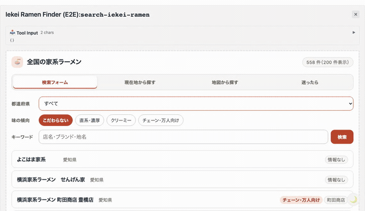
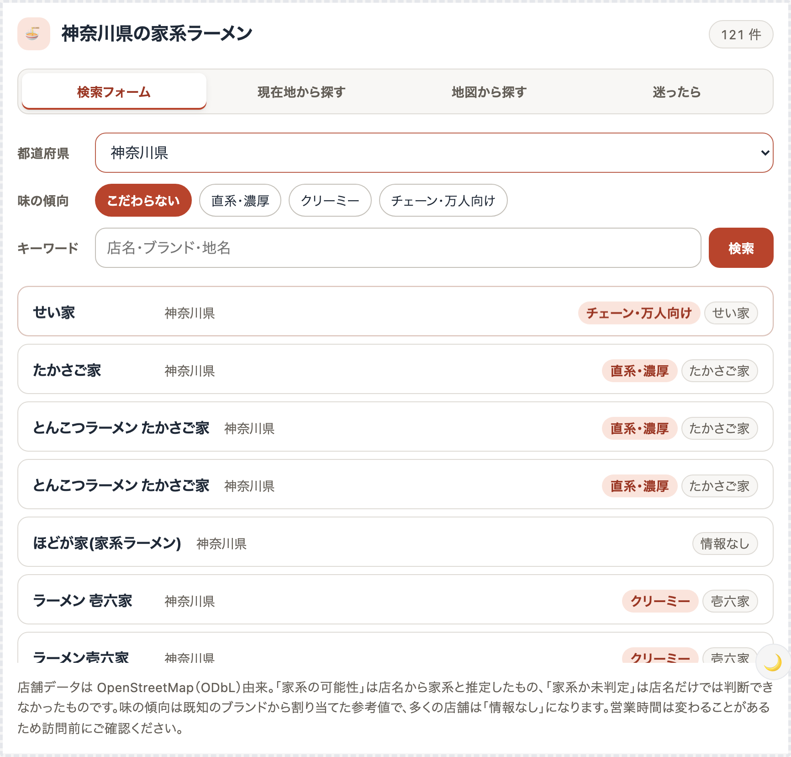
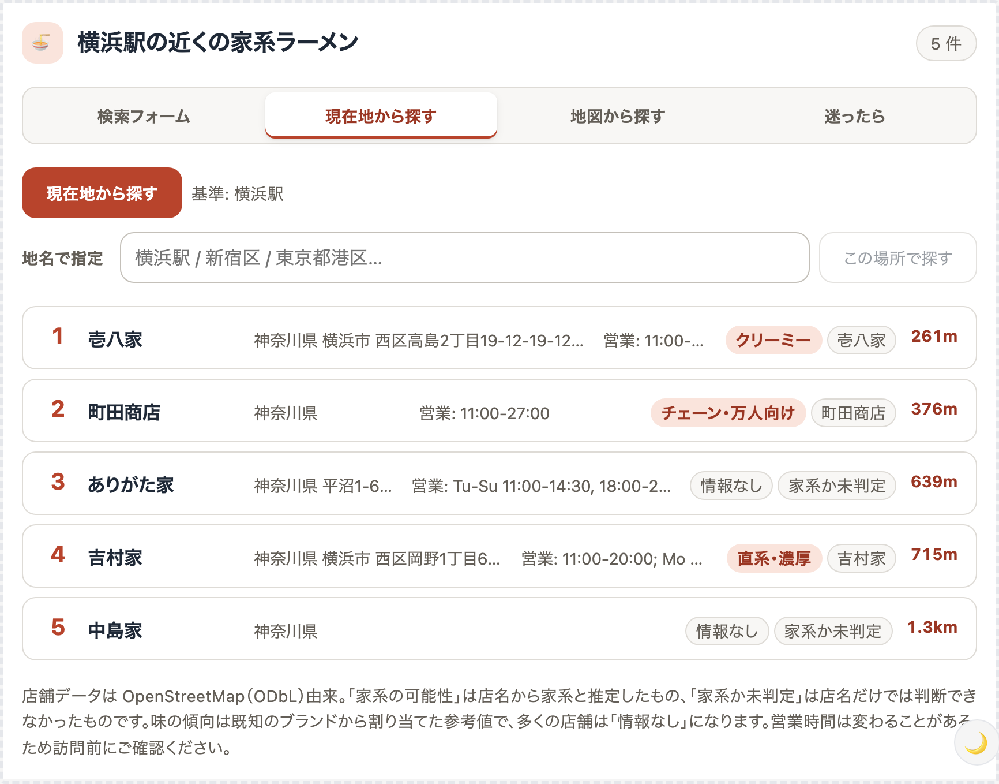
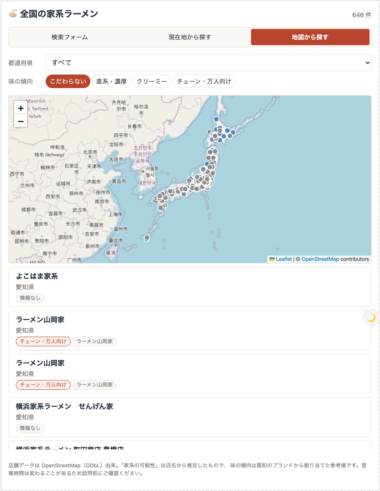

# 家系ラーメンを探す MCP Apps

[](https://github.com/yamazaki-yuki-23/iekei-ramen-mcp-apps/actions/workflows/ci.yml)

家系ラーメン店を「検索フォーム」「現在地から探す」「地図から探す」の 3 モードで
探せる MCP Apps です。Claude などの MCP Apps 対応ホストの中で UI が動きます。



| 検索フォーム                                                 | 現在地から探す                                    | 地図から探す                                       |
| ------------------------------------------------------------ | ------------------------------------------------- | -------------------------------------------------- |
|  |  |  |

|                    |                                                      |
| ------------------ | ---------------------------------------------------- |
| **検索フォーム**   | 都道府県・味の傾向・キーワードで全国から絞り込む     |
| **現在地から探す** | 位置情報または地名から、近い順に 5 店舗を提案する    |
| **地図から探す**   | 全国の店舗を日本地図にプロットし、ピンから詳細を開く |

スクリーンショットと GIF は `npm run capture` で自動生成しています
（[e2e/capture.spec.ts](e2e/capture.spec.ts)）。

## 構成

| ファイル                      | 役割                                                              |
| ----------------------------- | ----------------------------------------------------------------- |
| `server.ts`                   | MCP サーバー本体。3 つの UI 付き tool と補助 tool を登録          |
| `worker.ts`                   | Cloudflare Workers エントリ（`/mcp` で Streamable HTTP を受ける） |
| `main.ts`                     | ローカル実行エントリ（HTTP / stdio）                              |
| `src/mcp-app.tsx`             | UI のシェル。モード切り替えと tool 呼び出し                       |
| `src/components/`             | 検索フォーム / 一覧 / 現在地パネル / 地図                         |
| `scripts/fetch-shops.mjs`     | OpenStreetMap から店舗データを取得                                |
| `scripts/judgments.mjs`       | TypeSafe に投げる質問と閾値。判定を変えるならここだけ見る         |
| `scripts/judge-all.mjs`       | 家系判定を実行して `data/judged.json` に保存                      |
| `scripts/find-duplicates.mjs` | 近い 2 件が同一店舗かを判定して `data/duplicates.json` に保存     |
| `scripts/rescore.mjs`         | 保存済みの確率から判定だけ作り直す（API 不要）                    |
| `scripts/build-dataset.mjs`   | 判定結果を整形して `data/shops.json` を生成                       |

## tool 一覧

| tool                      | 内容                                        |
| ------------------------- | ------------------------------------------- |
| `search-iekei-ramen`      | 都道府県 / 味の傾向 / キーワードで絞り込み  |
| `find-nearby-iekei-ramen` | 緯度経度から近い順に 5 件（既定）           |
| `show-iekei-ramen-map`    | 日本地図にプロット                          |
| `geocode-place`           | 地名 → 緯度経度（UI が内部で使う。UI なし） |

## セットアップ

```bash
npm install
npm run build        # UI をビルドして HTML をコードに埋め込み、型チェック
```

`data/shops.json` はリポジトリにコミットされるので、通常の開発でデータを
作り直す必要はありません。作り直す手順は「データを更新する」を見てください。

## ローカルで動かす

```bash
npm run dev
```

`http://localhost:3031/mcp` で MCP サーバーが起動します。
UI つきで確認する場合は MCP Apps SDK の basic-host が使えます。

```bash
git clone --depth 1 https://github.com/modelcontextprotocol/ext-apps.git /tmp/mcp-ext-apps
cd /tmp/mcp-ext-apps/examples/basic-host && npm install
SERVERS='["http://localhost:3031/mcp"]' npm run start   # → http://localhost:8080
```

Cloudflare のローカルランタイム（workerd）で確認する場合:

```bash
npm run dev:worker
```

## テスト・静的解析

```bash
npm test            # vitest（80 件）距離計算・家系判定・MCP サーバーの結合テスト
npm run e2e         # playwright（19 件）実ブラウザで 3 モードを操作する E2E
npm run lint        # oxlint
npm run format      # oxfmt（CI では format:check）
npm run knip        # 未使用のコード・依存の検出
```

E2E は MCP Apps SDK の basic-host を `e2e-host/` に取得して使います
（`npm run e2e:setup` が自動で行います）。
すべて [GitHub Actions](.github/workflows/ci.yml) で実行しています。

## Cloudflare にデプロイ

```bash
npx wrangler login
npm run deploy
```

デプロイ後の URL は `https://iekei-ramen-mcp.<account>.workers.dev/mcp` です。
Workers の無料枠（1 日 10 万リクエスト）で動く構成で、外部 DB もキーも使いません。

## Claude に接続する

Claude の Connectors 設定で、デプロイ先の `/mcp` URL をカスタムコネクタとして追加します。

## データについて

現在のデータ: **558 店舗 / 37 都道府県**
（「家系」328 件、「家系の可能性」6 件、「家系か未判定」224 件）

- 出典は [OpenStreetMap](https://www.openstreetmap.org/copyright) の contributors（ODbL）です。
- 家系判定は推定です。OSM のタグを [TypeSafe](https://typesafe.ai) に渡して
  ジャンルを判断させ、既知ブランドの対応表と突き合わせています。3 段階あります。
  - **家系** … 店名が家系を名乗っている、または既知の家系ブランド
  - **家系の可能性** … 名乗ってはいないが、店名からジャンルを家系と推定できる
  - **家系か未判定** … ラーメン店で屋号が「〜家」だが、店名からは判断できない
  - 別ジャンルだと判断できた店（博多・塩・味噌・つけ麺・中華料理店・食堂など）は
    一覧に載せていません。
- **味の傾向は参考値です。** OSM に味のデータは無いため、既知のブランドから
  `直系・濃厚` / `クリーミー` / `チェーン・万人向け` を割り当てています。
  判定できない店舗は `情報なし` になります。
- 営業時間・電話番号も OSM 由来で、実際と異なる場合があります。

## データを更新する

```bash
npm run data:fetch    # OSM から取得（20〜30 分）      → data/osm-raw.json
npm run data:judge    # 家系判定（要 TYPESAFE_API_KEY） → data/judged.json
npm run data:dedupe   # 重複判定（要 TYPESAFE_API_KEY） → data/duplicates.json
npm run data:build    # 整形（API キー不要）            → data/shops.json
```

`data:judge` と `data:dedupe` は [TypeSafe](https://typesafe.ai) を使うので
`TYPESAFE_API_KEY` が要ります。`.dev.vars` に書いておけば読まれます
（`node --env-file-if-exists` を使うので Node 22.9 以降）。全件で $0.05 ほど。

`data:judge` は判定済みのものを飛ばすので、取り直しても差分だけで済みます
（タグが変わった要素は判定し直します）。判定されていない要素が残っていると
`data:build` はエラーで止まります。

判定に関わるファイルを変えたときに何を再実行するかは、変えた場所で決まります。
判定の材料（確率・スコア）は保存してあるので、方針を変えるだけなら API は要りません。

| 変えたもの                                           | 再実行するもの                       | API  |
| ---------------------------------------------------- | ------------------------------------ | ---- |
| 家系判定の閾値（`CONFIRMED_AT` など）と `decide()`   | `data:rescore` → `data:build`        | 不要 |
| `KNOWN_BRANDS` / `EXCLUDE`（`scripts/classify.mjs`） | `data:rescore` → `data:build`        | 不要 |
| 重複の閾値（`SAME_SHOP_AT`）                         | `data:build` だけ                    | 不要 |
| 質問文（`QUESTIONS`）、`shopState`                   | `data:judge -- --all` → `data:build` | 要   |
| 重複判定の質問（`PAIR_QUESTION`）、`PAIR_RADIUS_M`   | `data:dedupe` → `data:build`         | 要   |

`rescore` は保存済みの確率を `decide()` に通し直すだけで、モデルには問い合わせません。
質問文を変えたら確率そのものが変わるので `rescore` では反映されません。

**対応表（`KNOWN_BRANDS` / `EXCLUDE`）を変えたら `rescore` が要ります。**
表は `knownFacts()` 経由で判定と味の両方に効きますが、OSM のタグは変わらないので
`data:judge` は 1 件も処理しません。`data:build` も保存済みの判定を信じるため、
`rescore` を挟まないと古い分類のままビルドが成功してしまいます。

`SAME_SHOP_AT` は `data:build` が保存済みスコアに毎回当てるので、`rescore` も
`dedupe` も要りません。判定が古いまま進むことはなく、`osm-raw.json` と
食い違っていれば `data:build` がエラーで止まります。
