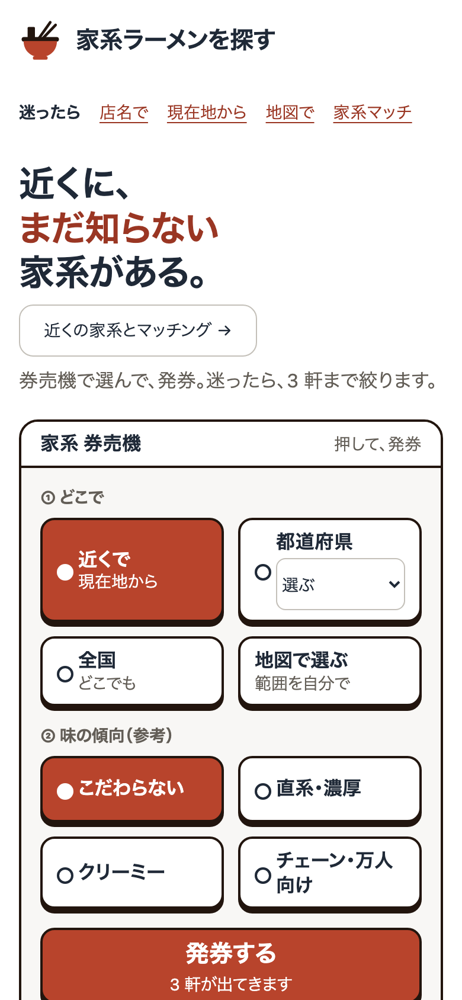
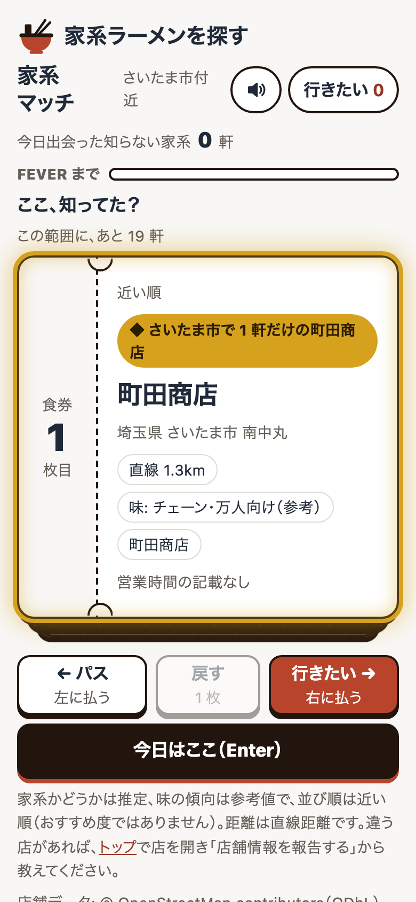

# 家系ラーメンを探す

家系ラーメンの店を探して、**今日どこで食べるかを決めるところまで**つなぐアプリです。
ブラウザで開く Web 版（**https://iekeiramen.com** ）と、Claude・ChatGPT の会話の中で使えます。

一覧を眺めるだけでは決まらないので、券売機で条件を選んで**3 軒まで絞る**（迷ったら）、
**回る順番を出す**（まわる店）ところまでを画面に持っています。

| Web 版のトップ（券売機）                                          | 家系マッチ                                                     |
| ----------------------------------------------------------------- | -------------------------------------------------------------- |
|  |  |

## どこで使えるか

| 場所                 | URL                                        | 向いている使い方                                     |
| -------------------- | ------------------------------------------ | ---------------------------------------------------- |
| **Web 版**           | https://iekeiramen.com                     | ブラウザでそのまま探す。登録もサインインも要らない   |
| **家系マッチ**       | https://iekeiramen.com/match/              | 近くのまだ知らない家系を、1 枚ずつ見て決める         |
| **都道府県から探す** | https://iekeiramen.com/area/               | 県・市区町村・店ごとのページから探す                 |
| **Claude・ChatGPT**  | 接続の案内: https://iekeiramen.com/connect | 会話しながら探す。選んだ店についてそのまま質問できる |

## できること

| 機能                   | 内容                                                                                               |
| ---------------------- | -------------------------------------------------------------------------------------------------- |
| **迷ったら**（券売機） | 「どこで」（近くで・都道府県・全国・地図で選ぶ）と味の傾向を選んで発券すると、最大 3 軒が出る      |
| **店名で**             | ブランドのキーを押すか、店名・ブランド・地名を打って探す                                           |
| **現在地から**         | 位置情報か地名・駅名から、近い順に 5 軒を出す                                                      |
| **地図で**             | 全国の店を地図に並べ、ピンから店を開く。表示している範囲で探し直せる                               |
| **まわる店**           | 2〜3 軒を積むと、回る順番と距離を出して Google マップへ渡す                                        |
| **注文のしかた**       | 選んだ店の欄に、お好み・卓上・ライスの頼み方を畳んで置いてある                                     |
| **家系マッチ**         | 近い店を「行きたい」「パス」に振り分け、今日の 1 軒を決める                                        |
| **行った店**           | 行った店を記録し、県ごと・全国の制覇率を出す（会話の中だけ。Google でのサインインが要る）          |
| **店舗情報を報告する** | Web 版で、店の欄から「家系ではない」「閉店している」を、一覧の下から載っていない家系を匿名で送れる |

## 会話の中で使う（Claude・ChatGPT）

会話の中でも同じ券売機と一覧が開きます。画面で選んだ 1 軒はモデルにも渡るので、
続けて「この店どう？」と聞けます。

| 迷ったら                                                    | 店名で                                             | 現在地から                                 |
| ----------------------------------------------------------- | -------------------------------------------------- | ------------------------------------------ |
|  |  |  |

| 地図で                                            | まわる店                                                  | 行った店                                            |
| ------------------------------------------------- | --------------------------------------------------------- | --------------------------------------------------- |
|  |  |  |

追加のしかた:

- **ChatGPT**: コネクタに `https://iekeiramen.com/mcp` を追加する。認証は「**OAuth または認証なし**」を選ぶ
- **Claude**: 本番の URL を追加する手順は、まだ確認できていません。確認できるまでは Web 版を使ってください

詳しい手順と会話の例は [接続の案内](https://iekeiramen.com/connect) にあります。

## サインインと記録

- **探すだけなら、サインインは要りません。** Web 版も会話の中も、匿名のまま使えます
- サインインが要るのは、会話の中の「行った店」の記録だけです。「行った」を押したときに、ホストが Google でのサインインを求めます（Web 版には記録の機能がありません）
- 記録は Google アカウントごとに保存するので、端末やホストが変わっても同じ記録が見えます。メールアドレスや名前は保存しません
- 家系マッチの「行きたい」は、その端末のブラウザにだけ残ります（サーバーには送りません）
- 記録はいつでも「記録を全部消す」で消せます（元に戻せません）

## データについて

- 店舗データの出典は [OpenStreetMap](https://www.openstreetmap.org/copyright) の contributors（ODbL）です
- 載せているのは、地図の記載を判定した結果の **564 軒**（40 都道府県）です。全国の家系ラーメン店の総数ではありません
- **家系かどうかは推定です。** 地図の記載と既知のブランドから判断しているので、家系ではない店が混ざることがあります
- **味の傾向は参考値です。** 地図に味の情報は無いので、既知のブランドから割り当てています。実食に基づくものではありません
- **距離は直線距離です。** 道のりや移動時間ではありません
- 並び順はおすすめ度ではありません（近い順など、並べた根拠を画面に出しています）
- 営業時間・電話番号も地図の記載によるもので、実際と違うことがあります。営業状況は店舗の公式情報で確かめてください
- 違う店を見つけたら、Web 版でその店を開き「**店舗情報を報告する**」から教えてください。届いた報告は確かめてから反映します

## 開発者の方へ

作り・動かし方・データの更新は、次のファイルにあります。

| 知りたいこと                                       | 場所                                                                                    |
| -------------------------------------------------- | --------------------------------------------------------------------------------------- |
| 全体像の図・ファイル構成・tool 一覧                | [docs/development.md「アーキテクチャ」](docs/development.md#アーキテクチャ)             |
| セットアップ・ローカルで動かす                     | [docs/development.md「動作確認」](docs/development.md#動作確認)                         |
| テスト・静的解析                                   | [docs/development.md「テスト」](docs/development.md#テスト)                             |
| デプロイ・外部サービス・記録の置き場               | [docs/development.md「デプロイ」](docs/development.md#デプロイ)                         |
| 店舗データの作り方・更新・判定の段階               | [docs/development.md「データ」](docs/development.md#データ)                             |
| 開発の進め方（Claude Code・Codex・issue の回し方） | [docs/development.md「開発の進め方」](docs/development.md#開発の進め方claude-codecodex) |
| 作業のルール・見た目の決まり                       | [AGENTS.md](AGENTS.md)・[DESIGN.md](DESIGN.md)                                          |
