# 家系ラーメンを探す MCP Apps

[](https://github.com/yamazaki-yuki-23/iekei-ramen-mcp-apps/actions/workflows/ci.yml)
[](https://claude.com/claude-code)

家系ラーメン店を探して、**今日どこで食べるかを決めるところまで**繋ぐ MCP Apps です。
Claude などの MCP Apps 対応ホストの中で UI が動きます。

> 564 件の一覧を出しても満足は生まれません。決まったときに生まれます。
> だから「絞り込む」だけでなく、**3 軒まで落とす**（迷ったら）と
> **回る順番を出す**（まわる店）までを画面に持っています。

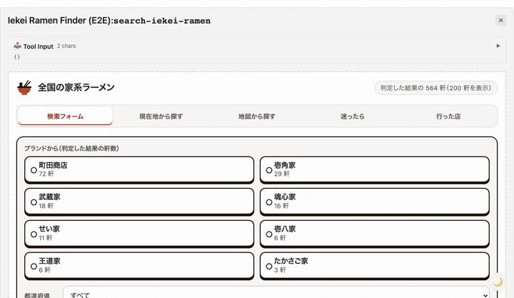

| 検索フォーム                                                 | 現在地から探す                                    | 地図から探す                                    |
| ------------------------------------------------------------ | ------------------------------------------------- | ----------------------------------------------- |
| 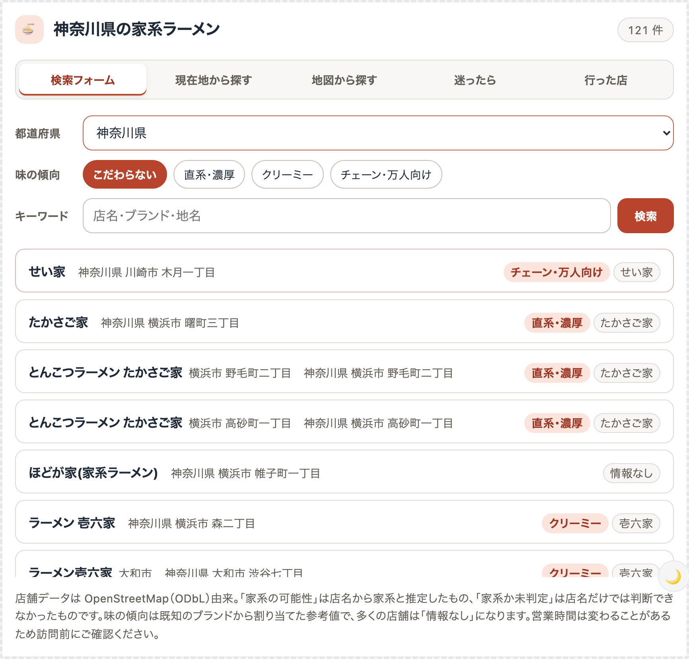 | 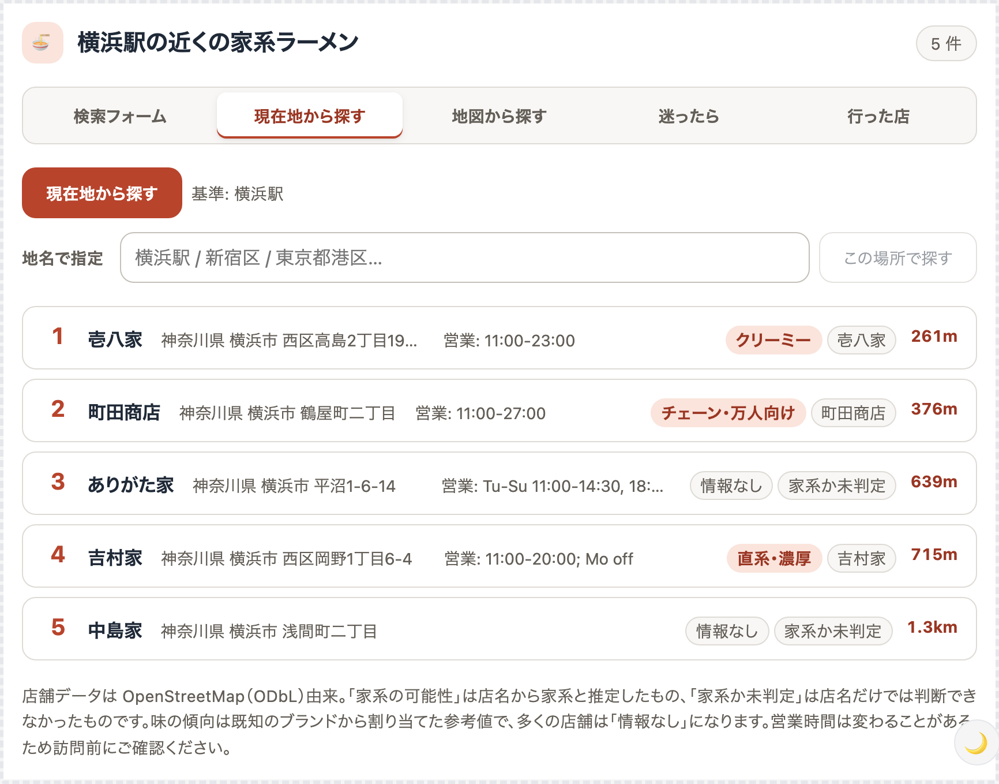 | 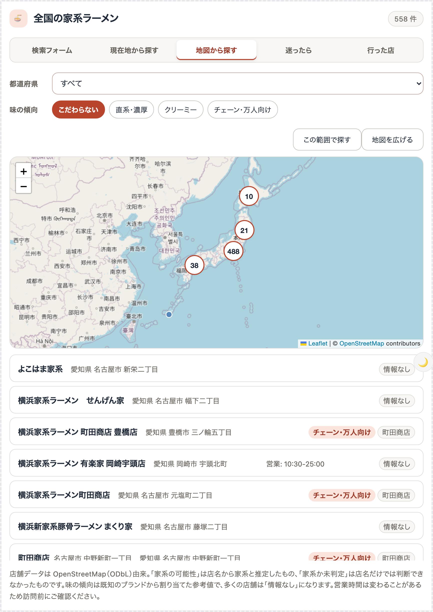 |

| 迷ったら                                                | まわる店                                                  | 行った店                                               |
| ------------------------------------------------------- | --------------------------------------------------------- | ------------------------------------------------------ |
| 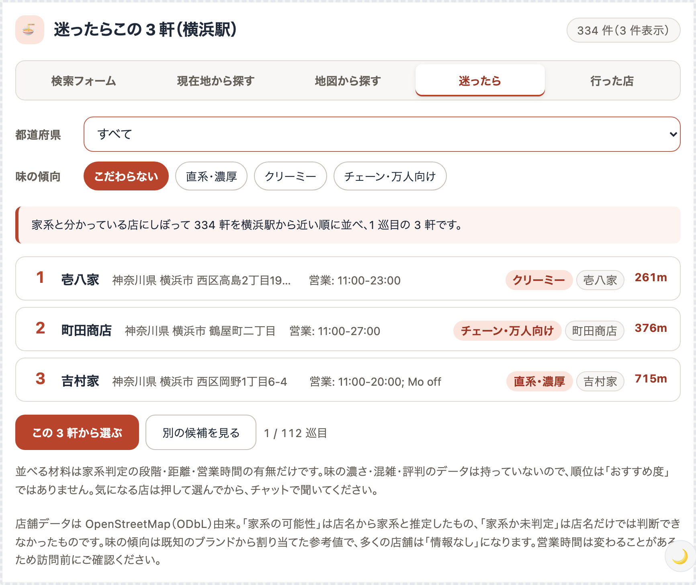 | 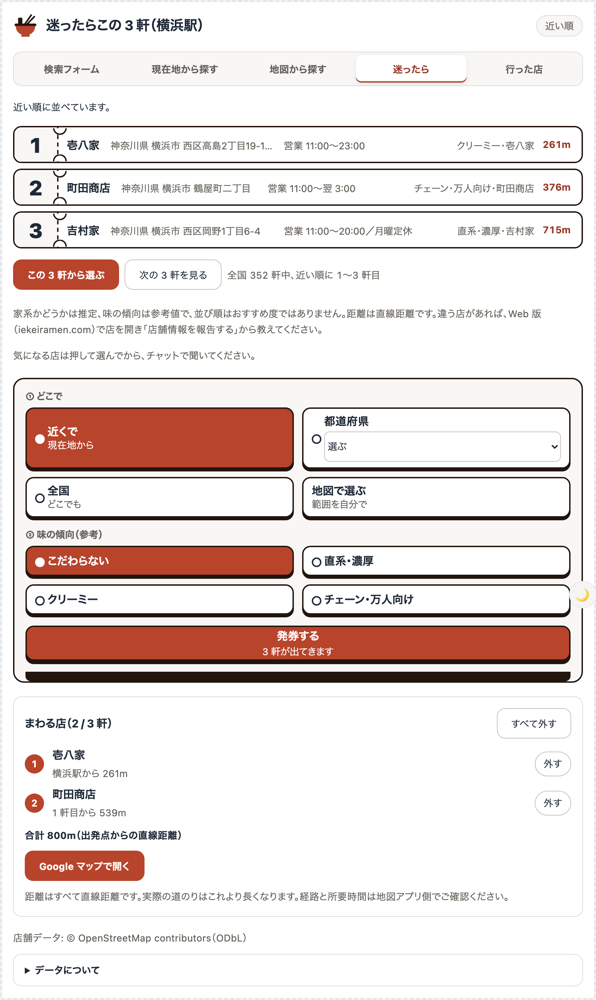 | 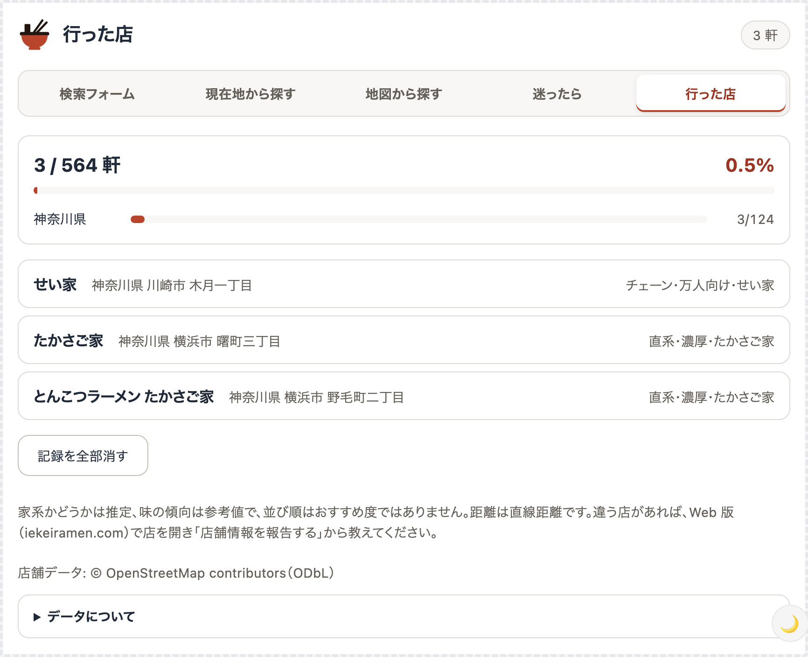 |

|                    |                                                                  |
| ------------------ | ---------------------------------------------------------------- |
| **検索フォーム**   | 都道府県・味の傾向・キーワードで全国から絞り込む                 |
| **現在地から探す** | 位置情報または地名から、近い順に 5 店舗を提案する                |
| **地図から探す**   | 全国の店舗を日本地図にプロットし、ピンから詳細を開く             |
| **迷ったら**       | 条件から 3 軒まで落とし、その中の 1 軒をモデルに推してもらう     |
| **まわる店**       | 2〜3 軒を積むと回る順番と距離を出し、Google マップへ渡す         |
| **行った店**       | 行った店を記録し、県ごと・全国の制覇率を出す（サインインが要る） |

**匿名のまま検索できます。** サインインが要るのは記録（行った店）だけです。

選んだ 1 軒はモデルにも渡るので、そのまま「この店どう？」と聞けます。
券売機の前で困らないよう、**注文のしかた**（お好み・卓上・ライス）も
選択中の店のパネルに畳んで置いてあります。

スクリーンショットと GIF は `npm run capture` で自動生成しています
（[e2e/capture.spec.ts](e2e/capture.spec.ts) と
[e2e/capture-demo.spec.ts](e2e/capture-demo.spec.ts)）。
画面を変えたら撮り直してください。

## 全体像

ホスト（Claude / ChatGPT）の中で UI が動き、**画面の操作もモデルの依頼も、同じ tool を通ります。**

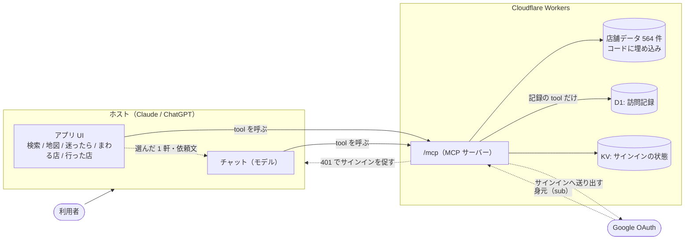
```mermaid
flowchart LR
  user([利用者]) --> host

  subgraph host["ホスト（Claude / ChatGPT）"]
    chat["チャット（モデル）"]
    app["アプリ UI<br/>検索 / 地図 / 迷ったら / まわる店 / 行った店"]
  end

  chat -- "tool を呼ぶ" --> worker
  app -- "tool を呼ぶ" --> worker
  app -. "選んだ 1 軒・依頼文" .-> chat

  subgraph cf["Cloudflare Workers"]
    worker["/mcp（MCP サーバー）"]
    shops[("店舗データ 564 件<br/>コードに埋め込み")]
    d1[("D1: 訪問記録")]
    kv[("KV: サインインの状態")]
  end

  worker --> shops
  worker -- "記録の tool だけ" --> d1
  worker --> kv
  worker -. "401 でサインインを促す" .-> host
  worker -. "サインインへ送り出す" .-> google([Google OAuth])
  google -. "身元（sub）" .-> worker
```

**UI から呼んでもモデルから呼んでも、返るものは同じ**（画面用の構造化データと、モデル向けの文）。
だから画面で絞り込んだ直後に「この中どれがいい？」と聞けます。

### 機能と tool の対応

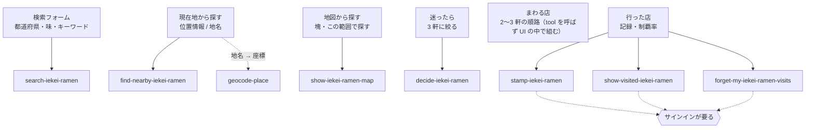
```mermaid
flowchart TD
  search["検索フォーム<br/>都道府県・味・キーワード"] --> t1["search-iekei-ramen"]
  nearby["現在地から探す<br/>位置情報 / 地名"] --> t2["find-nearby-iekei-ramen"]
  nearby -. "地名 → 座標" .-> t5["geocode-place"]
  map["地図から探す<br/>塊・この範囲で探す"] --> t3["show-iekei-ramen-map"]
  decide["迷ったら<br/>3 軒に絞る"] --> t4["decide-iekei-ramen"]
  route["まわる店<br/>2〜3 軒の順路（tool を呼ばず UI の中で組む）"]
  visited["行った店<br/>記録・制覇率"] --> t6["stamp-iekei-ramen"]
  visited --> t7["show-visited-iekei-ramen"]
  visited --> t8["forget-my-iekei-ramen-visits"]

  t6 -.-> auth{{"サインインが要る"}}
  t7 -.-> auth
  t8 -.-> auth
```

### 記録するまで（匿名からサインインまで）

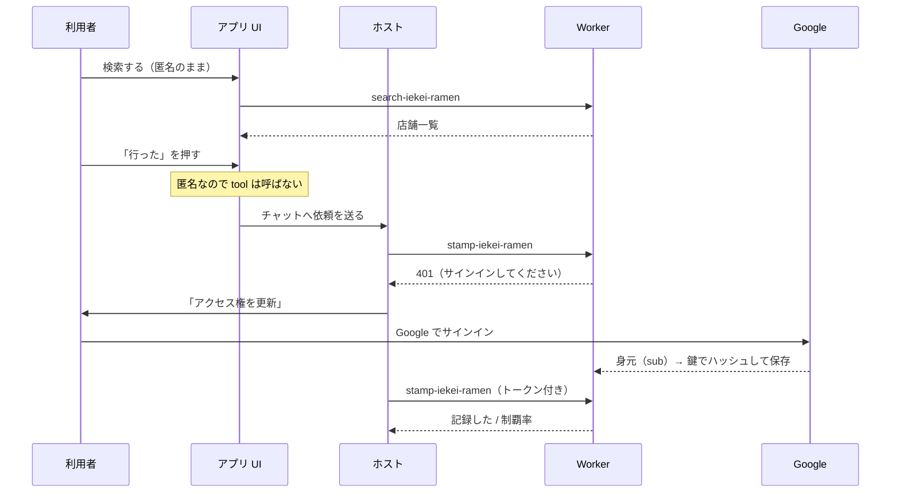
```mermaid
sequenceDiagram
  participant U as 利用者
  participant A as アプリ UI
  participant H as ホスト
  participant W as Worker
  participant G as Google

  U->>A: 検索する（匿名のまま）
  A->>W: search-iekei-ramen
  W-->>A: 店舗一覧
  U->>A: 「行った」を押す
  Note over A: 匿名なので tool は呼ばない
  A->>H: チャットへ依頼を送る
  H->>W: stamp-iekei-ramen
  W-->>H: 401（サインインしてください）
  H->>U: 「アクセス権を更新」
  U->>G: Google でサインイン
  G-->>W: 身元（sub）→ 鍵でハッシュして保存
  H->>W: stamp-iekei-ramen（トークン付き）
  W-->>H: 記録した / 制覇率
```

## 構成

| ファイル                      | 役割                                                              |
| ----------------------------- | ----------------------------------------------------------------- |
| `server.ts`                   | MCP サーバー本体。7 つの UI 付き tool と補助 tool を登録          |
| `worker.ts`                   | Cloudflare Workers エントリ（`/mcp` で Streamable HTTP を受ける） |
| `main.ts`                     | ローカル実行エントリ（HTTP / stdio）                              |
| `src/mcp-app.tsx`             | UI のシェル。モード切り替えと tool 呼び出し                       |
| `src/components/`             | 検索フォーム / 一覧 / 現在地パネル / 地図 / 迷ったら / まわる店   |
| `src/lib/shortlist.ts`        | 「迷ったら」の 3 軒の選び方。おすすめ順は作らない                 |
| `src/lib/route.ts`            | 「まわる店」の順番と距離、地図アプリへ渡す URL                    |
| `src/lib/model-context.ts`    | 選んだ 1 軒をモデルへ渡す列（順番・失敗・やり直し）               |
| `src/lib/shop-brief.ts`       | モデルに渡す文面。推定には但し書きを付ける                        |
| `oauth.ts`                    | Google サインインと、記録の tool に返す 401                       |
| `src/lib/visits.ts`           | 訪問記録の読み書き（D1）。SQL はここだけ                          |
| `src/lib/progress.ts`         | 制覇率。順位も称号も作らない                                      |
| `src/lib/same-name.ts`        | 同名の店が並ぶときだけ、名前の隣に出す地名を決める                |
| `migrations/`                 | D1 のスキーマ（デプロイ時に適用）                                 |
| `scripts/overpass-query.mjs`  | Overpass のクエリと取得の手順。拾う条件を変えるならここだけ見る   |
| `scripts/fetch-shops.mjs`     | OpenStreetMap から店舗データを取得                                |
| `scripts/judgments.mjs`       | TypeSafe に投げる質問と閾値。判定を変えるならここだけ見る         |
| `scripts/judge-all.mjs`       | 家系判定を実行して `data/judged.json` に保存                      |
| `scripts/find-duplicates.mjs` | 近い 2 件が同一店舗かを判定して `data/duplicates.json` に保存     |
| `scripts/rescore.mjs`         | 保存済みの確率から判定だけ作り直す（API 不要）                    |
| `scripts/fill-areas.mjs`      | 住所の欠けている店を座標から逆引き（Nominatim）                   |
| `scripts/build-dataset.mjs`   | 判定結果を整形して `data/shops.json` を生成                       |

## tool 一覧

| tool                      | 内容                                           |
| ------------------------- | ---------------------------------------------- |
| `search-iekei-ramen`      | 都道府県 / 味の傾向 / キーワードで絞り込み     |
| `find-nearby-iekei-ramen` | 緯度経度から近い順に 5 件（既定）              |
| `show-iekei-ramen-map`    | 日本地図にプロット                             |
| `decide-iekei-ramen`      | 3 軒まで落として、1 軒を理由つきで推してもらう |
| `geocode-place`           | 地名 → 緯度経度（UI が内部で使う。UI なし）    |

サインインした人だけが使える tool（匿名で呼ぶと 401 を返します）:

| tool                           | 内容                       |
| ------------------------------ | -------------------------- |
| `stamp-iekei-ramen`            | 行った印を付ける / 外す    |
| `show-visited-iekei-ramen`     | 行った店と制覇率を見る     |
| `forget-my-iekei-ramen-visits` | 記録を全部消す（戻せない） |

## セットアップ

```bash
npm install
npm run build        # UI をビルドして HTML をコードに埋め込み、型チェック
```

`data/shops.json` はリポジトリにコミットされるので、通常の開発でデータを
作り直す必要はありません。作り直す手順は「データを更新する」を見てください。

## ローカルで動かす

```bash
npm run dev
```

`http://localhost:3031/mcp` で MCP サーバーが起動します。
UI つきで確認する場合は MCP Apps SDK の basic-host が使えます。

```bash
git clone --depth 1 https://github.com/modelcontextprotocol/ext-apps.git /tmp/mcp-ext-apps
cd /tmp/mcp-ext-apps/examples/basic-host && npm install
SERVERS='["http://localhost:3031/mcp"]' npm run start   # → http://localhost:8080
```

Cloudflare のローカルランタイム（workerd）で確認する場合:

```bash
npm run dev:worker
```

## テスト・静的解析

```bash
npm test            # vitest（279 件）距離計算・家系判定・MCP サーバーの結合テスト
npm run e2e         # playwright（108 件）実ブラウザで 5 モード・順路・記録を操作する E2E
npm run lint        # oxlint
npm run format      # oxfmt（CI では format:check）
npm run knip        # 未使用のコード・依存の検出
```

E2E は MCP Apps SDK の basic-host を `e2e-host/` に取得して使います
（`npm run e2e:setup` が自動で行います）。記録まわりだけは、偽のサインイン済み
利用者で動くサーバー（`IEKEI_DEV_VISITOR`）を別のポートで立てて確かめています。
**この道は `main.ts` にしかなく、本番には出ません。**
すべて [GitHub Actions](.github/workflows/ci.yml) で実行しています。

## Cloudflare にデプロイ

```bash
npx wrangler login
npm run deploy
```

本番の URL は `https://iekeiramen.com/mcp` です。自分のアカウントへデプロイするときは、[wrangler.jsonc](wrangler.jsonc) の `routes` を自分のドメインに変えるか、消してください（消すと `https://iekei-ramen-mcp.<account>.workers.dev/mcp` になります）。

**店舗データはコードに埋め込むので、DB もストレージも要りません**（検索・絞り込み・
「迷ったら」「まわる店」は、この埋め込みデータだけで完結します）。

ただし**実行時に外へ出る経路が 2 つ**あります。どちらも OpenStreetMap で、
落ちているとその機能だけが使えません（他の機能は動きます）。

| 経路                               | 使う場面                                   | 失敗すると                       |
| ---------------------------------- | ------------------------------------------ | -------------------------------- |
| Nominatim（`geocode-place`）       | 「現在地から探す」で地名・駅名を入れたとき | その地名を座標にできない         |
| タイル（`tile.openstreetmap.org`） | 「地図から探す」の背景                     | 地図の背景が出ない（ピンは出る） |

記録（行った店）を動かすときは、Cloudflare の無料枠に収まる範囲で次を使います。

| 使うもの     | 何を置くか                                            |
| ------------ | ----------------------------------------------------- |
| D1           | 訪問記録（`migrations/` のスキーマ）                  |
| KV           | サインインの状態（トークン・認可）                    |
| Google OAuth | 身元の確認（`openid` だけ。メールも名前も保存しない） |

**表は出す前に作ります。** `npm run deploy` も CI も、`wrangler deploy` の前に
`npm run db:migrate`（`migrations/` を D1 へ適用）を通します。逆にすると、
出た直後のリクエストがまだ無い表を触ります。

`GOOGLE_CLIENT_ID` は `wrangler.jsonc` の `vars`、`GOOGLE_CLIENT_SECRET` と
`VISITOR_ID_PEPPER` は `npx wrangler secret put` で登録します。
**`VISITOR_ID_PEPPER` は変えられません**（変えると全員の記録が迷子になります）。

## ホストに接続する

デプロイ先の `/mcp` URL をカスタムコネクタとして追加します。**URL は 1 本です。**
認証の種類を選べるホスト（ChatGPT など）では「**OAuth または認証なし**」を選びます。

- 匿名のまま検索・地図・まわる店まで使えます
- 「行った」を押したときだけサインインを求められます（ホストが「アクセス権を更新」を出します）
- 記録は Google アカウントごとに保存されるので、端末やホストが変わっても同じ記録が見えます

ChatGPT では一連の流れを実機で確認しています。Claude は Claude Desktop に手元のサーバー（`main.ts --stdio`）を登録して、画面・モデルへの受け渡し・全画面・会員の画面まで確認しています。本番の URL をコネクタとして追加することと、本物のサインインは未検証です（#63）。

## 作り方（Claude Code）

このリポジトリは **[Claude Code](https://claude.com/claude-code) で作っています。**
設計の判断とその理由は [CLAUDE.md](CLAUDE.md) と [DESIGN.md](DESIGN.md) に書いてあり、
**Claude Code はまずそこを読んでから手を動かします。**

進め方は 1 本道です。

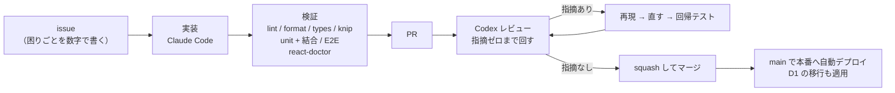
```mermaid
flowchart LR
  issue["issue<br/>（困りごとを数字で書く）"] --> impl["実装<br/>Claude Code"]
  impl --> verify["検証<br/>lint / format / types / knip<br/>unit + 結合 / E2E<br/>react-doctor"]
  verify --> pr["PR"]
  pr --> review["Codex レビュー<br/>指摘ゼロまで回す"]
  review -- "指摘あり" --> fix["再現 → 直す → 回帰テスト"]
  fix --> review
  review -- "指摘なし" --> merge["squash してマージ"]
  merge --> deploy["main で本番へ自動デプロイ<br/>D1 の移行も適用"]
```

守っていることが 3 つあります。

- **数字で再現してから直す。** 「直しました」だけの返信はしません
- **回帰テストは、直す前に戻すと落ちることを確かめてから足す。** 落ちないテストは
  何も見張っていないので、足さずに捨てます
- **なぜそうしたかをコードのコメントに残す。** 何をしているかはコードが語るので、
  コメントは理由の置き場にしています

## データについて

現在のデータ: **564 店舗 / 40 都道府県**
（「家系」345 件、「家系の可能性」7 件、「家系か未判定」212 件）

- 出典は [OpenStreetMap](https://www.openstreetmap.org/copyright) の contributors（ODbL）です。
- 家系判定は推定です。OSM のタグを [TypeSafe](https://typesafe.ai) に渡して
  ジャンルを判断させ、既知ブランドの対応表と突き合わせています。3 段階あります。
  - **家系** … 地図の記載が家系を名乗っている、または既知の家系ブランド
  - **家系の可能性** … 名乗ってはいないが、記載からジャンルを家系と推定できる
  - **家系か未判定** … ラーメン店で屋号が「〜家」だが、記載からは判断できない
  - 「記載」は店名だけではありません。OSM の説明欄（`description`）や
    `cuisine:ja` に「横浜家系ラーメン」と書かれている店も「家系」になります。
  - 別ジャンルだと判断できた店（博多・塩・味噌・つけ麺・中華料理店・食堂など）は
    一覧に載せていません。
- **味の傾向は参考値です。** OSM に味のデータは無いため、既知のブランドから
  `直系・濃厚` / `クリーミー` / `チェーン・万人向け` を割り当てています。
  判定できない店舗は `情報なし` になります。
- 営業時間・電話番号も OSM 由来で、実際と異なる場合があります。
- **市区町村と町名は座標から引いています。** OSM の店舗タグに住所はほとんど
  入っておらず（564 件中 87 件）、同じ名前のチェーン店を見分けられないためです。
  座標から補うのは**市区町村と町名まで**で、番地は足しません（店の位置を特定する
  ためではなく、見分けるためです）。**OSM のタグに番地が入っている店（89 件）は、
  そのタグの住所がそのまま出ます**——現地で入力された住所の方が確かなので、
  座標由来の地名で上書きしません。

## データを更新する

```bash
npm run data:fetch    # OSM から取得（20〜30 分）      → data/osm-raw.json
npm run data:judge    # 家系判定（要 TYPESAFE_API_KEY） → data/judged.json
npm run data:dedupe   # 重複判定（要 TYPESAFE_API_KEY） → data/duplicates.json
npm run data:areas    # 住所の逆引き（API キー不要）    → data/areas.json
npm run data:build    # 整形（API キー不要）            → data/shops.json
```

`data:judge` と `data:dedupe` は [TypeSafe](https://typesafe.ai) を使うので
`TYPESAFE_API_KEY` が要ります。`.dev.vars` に書いておけば読まれます
（`node --env-file-if-exists` を使うので Node 22.9 以降）。全件で $0.05 ほど。

`data:judge` は判定済みのものを飛ばすので、取り直しても差分だけで済みます
（タグが変わった要素は判定し直します）。判定されていない要素が残っていると
`data:build` はエラーで止まります。

判定に関わるファイルを変えたときに何を再実行するかは、変えた場所で決まります。
判定の材料（確率・スコア）は保存してあるので、方針を変えるだけなら API は要りません。

| 変えたもの                                           | 再実行するもの                                      | API  |
| ---------------------------------------------------- | --------------------------------------------------- | ---- |
| 家系判定の閾値（`CONFIRMED_AT` など）と `decide()`   | `data:rescore` → `data:areas` → `data:build`        | 不要 |
| `KNOWN_BRANDS` / `EXCLUDE`（`scripts/classify.mjs`） | `data:rescore` → `data:areas` → `data:build`        | 不要 |
| 重複の閾値（`SAME_SHOP_AT`）                         | `data:build` だけ                                   | 不要 |
| 質問文（`QUESTIONS`）、`shopState`                   | `data:judge -- --all` → `data:areas` → `data:build` | 要   |
| 重複判定の質問（`PAIR_QUESTION`）、`PAIR_RADIUS_M`   | `data:dedupe` → `data:build`                        | 要   |

**判定を変えたら `data:areas` を挟みます。** 判定が変わると、それまで一覧に
載っていなかった店が載ることがあり、その店の地名はまだ引いていません
（`data:areas` は「いま載る店」だけを対象にするため）。挟まないと、その店だけ
市区町村が空のまま出ます。引き直しは差分だけなので、数秒で終わります。

重複の閾値だけを変えるときは要りません。重複と判定された店も含めて引いてあるので、
どちらが残っても地名は揃っています。

`rescore` は保存済みの確率を `decide()` に通し直すだけで、モデルには問い合わせません。
質問文を変えたら確率そのものが変わるので `rescore` では反映されません。

**対応表（`KNOWN_BRANDS` / `EXCLUDE`）を変えたら `rescore` が要ります。**
表は `knownFacts()` 経由で判定と味の両方に効きますが、OSM のタグは変わらないので
`data:judge` は 1 件も処理しません。`data:build` も保存済みの判定を信じるため、
`rescore` を挟まないと古い分類のままビルドが成功してしまいます。

`SAME_SHOP_AT` は `data:build` が保存済みスコアに毎回当てるので、`rescore` も
`dedupe` も要りません。判定が古いまま進むことはなく、`osm-raw.json` と
食い違っていれば `data:build` がエラーで止まります。
